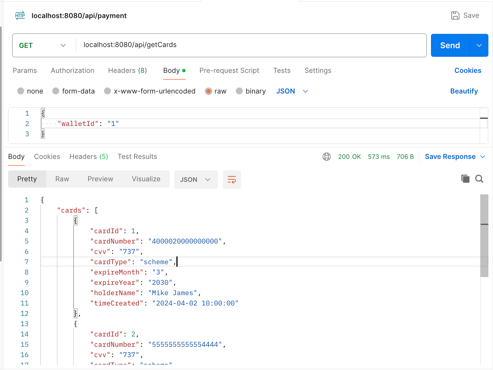
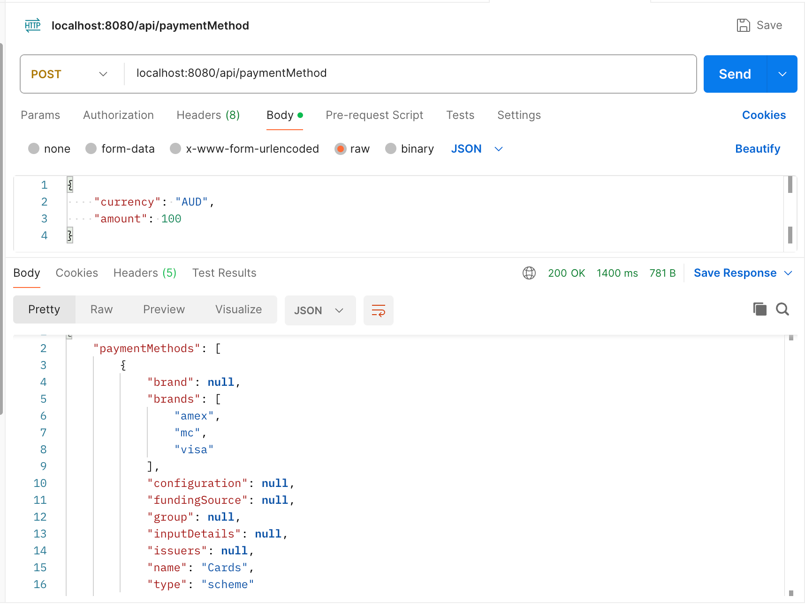
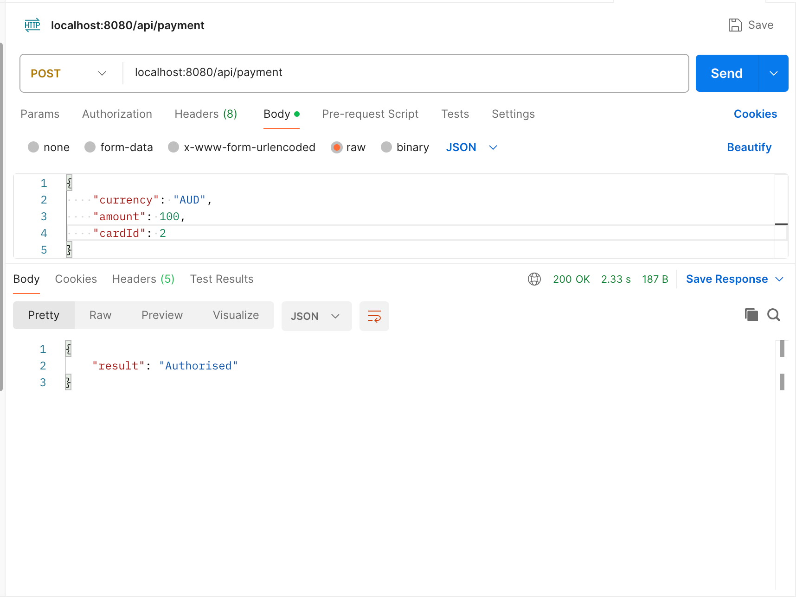

# Getting Started

## 1. Run the application

Go to src/main/java/com/payment/paymentcodechallenge/PaymentCodeChallengeApplication.java,
run the application.

Visit [http://localhost:8080/api/home](http://localhost:8080/api/home) to see if it is started.

Run the test of the application, go to src/test/java/com/payment/paymentcodechallenge/service/PaymentServiceTest.java and run all tests.

## 2. Call different API

### 1. getCards GET /api/getCards

| Request parameters | Required | Description                                                               | value                             |
|--------------------|----------|---------------------------------------------------------------------------|-----------------------------------|
| walletId           | Yes      | The primary key in wallet table. Each wallet can linked to several cards. | from 1 - 5 (only 5 records in DB) |

This API can be called from Postman as follows:

### 2. paymentMethod POST /api/paymentMethod

| Request parameters | Required | Description                                                                                                                                    | value                 |
|--------------------|----------|------------------------------------------------------------------------------------------------------------------------------------------------|-----------------------|
| currency           | No       | The current currency want to use for the payment. This is used to filter the list of available payment methods to your shopper.                | "AUD", "USD", etc.    |
| amount             | No       | The amount of the payment need to be processed. This is used to filter the list of available payment methods to your shopper.                  | Integer values.       |
| countryCode        | No       | The shopper's country code. This is used to filter the list of available payment methods to your shopper.                                      | "NL" (Netherlands)    |
| shopperLocale      | No       | Language and country code. This is used to translate the payment methods names in the response. By default, the shopperlocale is set to en-US. | "nl-NL" (Netherlands) |

This API can be called from Postman as follows:

### 3. payment POST /api/payment

| Request parameters | Required | Description                                       | value                        |
|--------------------|----------|---------------------------------------------------|------------------------------|
| currency           | Yes      | The current currency want to use for the payment. | "AUD", "USD", etc.           |
| amount             | Yes      | The amount of the payment needs to be processed.   | Integer values.              |
| cardId             | Yes      | Card id to use the chosen card.                    | from 1 - 5 (5 records in DB) |

This API can be called from Postman as follows:

| result     | Description                                                                                           |
|------------|-------------------------------------------------------------------------------------------------------|
| Authorised | The payment was successfully authorised.                                                              |
| Cancelled  | The payment was cancelled (by either the shopper or your own system) before processing was completed. |
| Error      | There was an error when the payment was being processed.                                              |
| Refused    | The payment was refused.                                                                              |

If you want to see more about result meanings or other result codes appear, 
please check here: [RESULT_CODE](https://docs.adyen.com/online-payments/build-your-integration/payment-result-codes/) to see more detailed information.

## 3. Database

The testDB.db file located in the root path is the DB in this application. It's driven by SQLite and embedded with the application. 

### Data Schema

### wallet

| column       | type                     | key         |
|--------------|--------------------------|-------------|
| id           | Integer (auto increment) | Primary key |
| user_id      | Integer                  | Unique key  |
| time_created | Text                     |             |

### card

| column       | type                     | key         |
|--------------|--------------------------|-------------|
| id           | Integer (auto increment) | Primary key |
| wallet_id    | Integer                  |             |
| card_number  | Text                     |             |
| expire_month | Integer                  |             |
| expire_year  | Integer                  |             |
| card_type    | Text                     |             |
| holder_name  | Text                     |             |
| cvv          | Integer                  |             |
| time_created | Text                     |             |

### payment

| column         | type                     | key         |
|----------------|--------------------------|-------------|
| id             | Integer (auto increment) | Primary key |
| card_id        | Integer                  |             |
| status         | Integer                  |             |
| time_created   | Text                     |             |
| time_finalised | Text                     |             |
| amount         | Integer                  |             |
| currency       | Text                     |             |

## 4. Overall design

### 1. Java Spring Boot
I choose Java Spring boot as the back-end in this application. 
The first reason why I choose Java Spring boot is that this is the tech stack I'm familiar with.
The second reason is that Spring Boot is easy for developing web applications and for RESTFUL APIs to do CRUD operations.

### 2. SQLite Database
I choose to use the relational database in this application. Among pretty much RDBMS, I choose SQLite eventually.
There are several reasons for me to make the decision.
1. It is simple to install and use, requiring minimal setup and configuration.
2. It is a file-based database, which makes it easy to store and share databases across different systems.
3. It is self-contained, which means that it does not require a separate server or daemon process to operate.

However, it has drawbacks like not supporting multi-threads, not being suitable for large-scale, and not being secure for a payment system. But in this application,
this lightweight DB wins the trade-off. In this application, this embedded DB is easy to share and do not need much to be configured.
That is the most reason I choose this DB.

But in the real world payment system, we need to have strong consistency for our DB and we need to support transactions. For real-world systems,
It's better to choose other relational Databases such as MySql, PostgreSQL, etc. 
